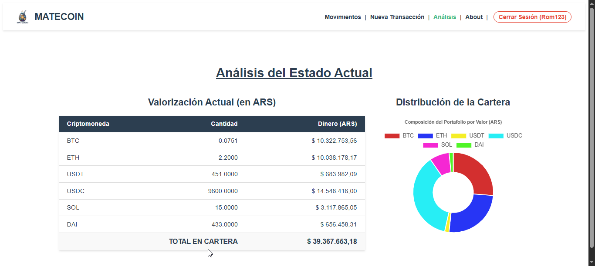

# 🧉 MateCoin - Gestor de Criptomonedas

> Proyecto Final de Laboratorio III - Tecnicatura Universitaria en Programación (UTN).

**MATECOING** es una aplicación web (SPA) desarrollada con Vue.js que permite la gestión integral, compra, venta y análisis de un portafolio de inversión en criptomonedas.

La aplicación se conecta a una base de datos NoSQL (**RestDB**) para la persistencia de usuarios y transacciones, y consume la API pública de **CriptoYa** para obtener cotizaciones en tiempo real.



## 🚀 Características Principales

### 1. Gestión de Identidad
* **Login Simple:** Acceso mediante ID alfanumérico único.
* **Persistencia de Sesión:** Uso de **Vuex** para mantener la sesión activa entre recargas.
* **Seguridad:** Navegación protegida (Guards) que impide acceso a rutas internas sin autenticación.

### 2. Operaciones (CRUD)
* **Alta de Transacciones:** Registro de compras y ventas con selectores dinámicos.
* **Historial Interactivo:** Tabla visual con filtros de colores para movimientos y acciones directas (Ver, Editar, Borrar).
* **Edición Inteligente:** Bloqueo de campos en modo lectura y recálculo automático de montos al editar.

### 3. Análisis Patrimonial
* **Dashboard:** Visualización del estado actual de la cartera.
* **Cálculo en Tiempo Real:** Las tenencias se valorizan en Pesos Argentinos (ARS) según la cotización del momento.
* **Visualización de Datos:** Gráfico de Dona (**Chart.js**) que muestra la composición porcentual de la cartera.

### 4. Validaciones de Negocio 
* **Control de Saldos:** El sistema impide registrar o editar una venta si el usuario no dispone de fondos suficientes en su historial histórico (evita saldos negativos).
* **Cálculo Automático:** Los montos en ARS se autocalculan basándose en el *Exchange* y la criptomoneda seleccionada.

## 🛠️ Stack Tecnológico

* **Frontend:** Vue.js 3 (Options API)
* **Estado:** Vuex 4
* **Enrutamiento:** Vue Router 4
* **Http Client:** Axios
* **Gráficos:** Chart.js & vue-chartjs
* **Backend:** RestDB.io (Base de datos)
* **API Externa:** CriptoYa API

## 📦 Instalación y Despliegue

Sigue estos pasos para correr el proyecto localmente:

1.  **Clonar el repositorio:**
    ```bash
    git clone [https://github.com/RomanLazzarini/matecoin.git](https://github.com/RomanLazzarini/matecoin.git)
    cd matecoin
    ```

2.  **Instalar dependencias:**
    ```bash
    npm install
    ```

3.  **Ejecutar en desarrollo:**
    ```bash
    npm run serve
    ```

4.  **Acceder:**
    Abre tu navegador en `http://localhost:8080`

## 👤 Autor

**Román Lazzarini**
Estudiante de Tecnicatura Universitaria en Programación.